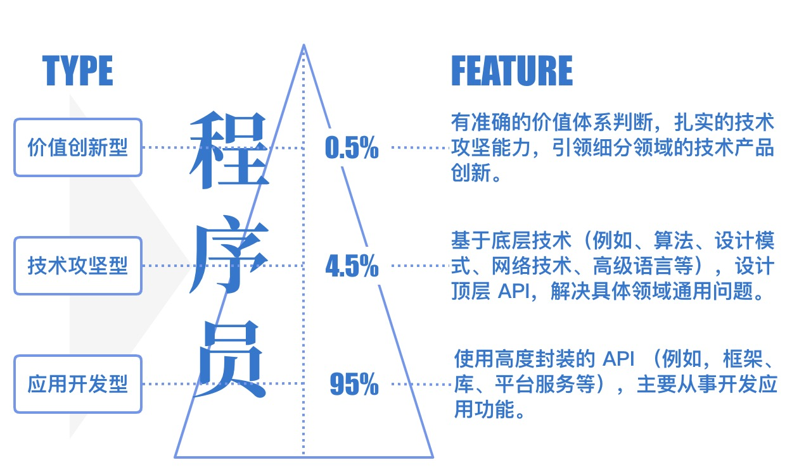
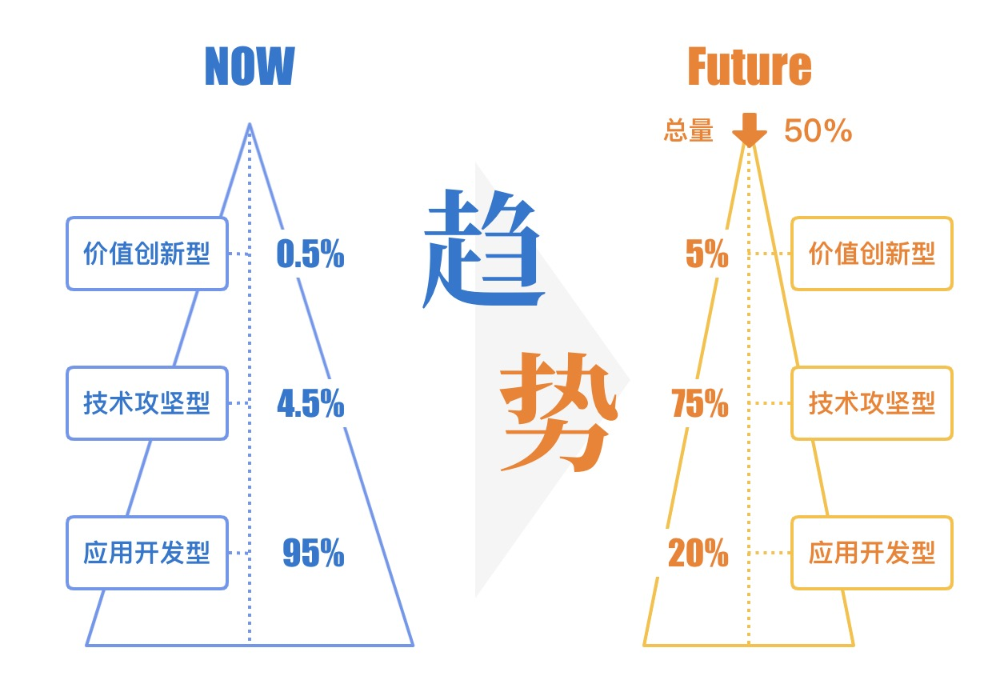
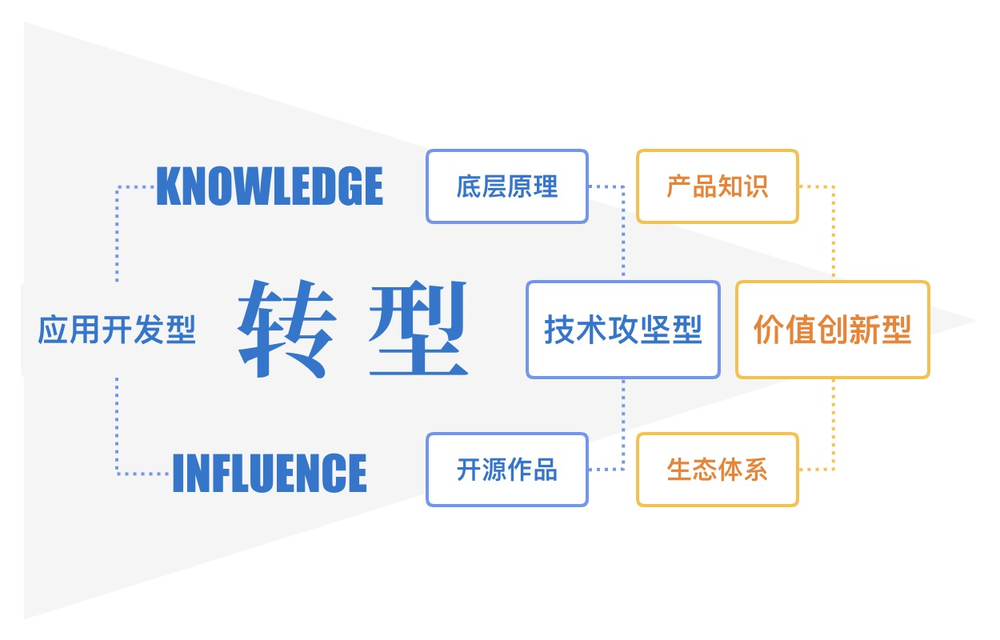

# 程序员的生存与发展 In 2022

> *据东方财富 Choice 统计，截止 2022年  4 月 30 日 A 股共有 4650 家企业公布了员工变动人数，其中有 1697 家企业进行了不同程度的裁员，裁员总数为 909993 人。*

互联网产业从 20 年之前的萌芽初期，一直保持着高速发展，然而时代赋予互联网的红利逐渐消失了。时代进程中，一个不可或缺的角色，**程序员**，又将何去何从？

## 职业定位

### 应用开发型程序员

特征：使用高度封装API（例如，框架、库、平台服务等），主要从事开发应用功能。

数量：占据程序员中绝大多数的从业者。在互联网高速发展时期，业务爆发式增长带来超高的业务利润率，使得**研发速度**带来的收益远大于**研发质量**的需要。市场人才供不应求，导致技术门槛要求较低，也促使大量的短期培训人员、非专业转型人员进入程序员的行业。

职业发展：该群体容易自我评估过高，忽略互联网红利的影响。同时，该群体具有较强的可替代性。

### 技术攻坚型程序员

特征：基于底层技术（例如、算法、设计模式、网络技术、高级语言等），设计顶层 API，解决具体领域通用问题。

数量：从业者中较少的一部分专业群体。在互联网业务爆发时期，该群体主要集中在巨头公司的核心技术部门，以及无法快速通过开源框架解决的业务团队中。

职业发展：该群体具备较强的核心竞争力， 一般有较多的核心技术作品或开源作品，对行业发展往往有一定的借鉴性。

### 价值创新型程序员

特征：有准确的价值体系判断，扎实的技术攻坚能力，引领细分领域的技术产品创新。

数量：技术攻坚型程序员中的佼佼者。互联网的发展，同时也带动了**开源领域**和**技术服务领域**的高速发展，这使得程序员的优秀作品能够快速的成为行业通用解决方案，在**企业级框架**、**工程自动化**、**AI 智能化**等诸多细分领域，都带来了与时俱进的发展。

职业发展：该群体是行业技术发展的领导者、先驱者、布道者。往往具备较强的综合能力和大局观，尤其是对技术产品、技术价值的深入理解。

> 那么，你属于哪一种类型呢？

## 未来趋势

计算机算力、工具自动化、人工智能等代表生产力的核心领域飞速发展，以及开源生态的日益繁荣，大幅度改变了程序员的开发模式。应用开发型程序员的大量工作被自动化与智能化取代，未来发展中，将仅有小部分应用型程序员负责复杂的业务维护。

2022年，中国网民突破10亿后，增量见顶，获客成本也随之提高。业务发展模式必将从暴力扩张，转变为稳定的发展，产品质量和技术壁垒的核心作用将越发明显。因此，业务缩减和自动化的双重因素，将使得程序员需求量锐减，该群体正在进入**社会结构性优化**的阶段。未来，技术攻坚型程序将成为企业发展的主要群体，其中价值创新型程序员依然是高端行业生产力发展的核心。

> 你是否具备核心竞争力，从而避免被优化呢？

## 应对变化

如何避免被结构性优化？向专业化“转型”将成为程序员保持竞争力的主要方式。但是这个过程仍然面临着残酷的竞争，成功完成专业化“转型”的两个重要因素是**知识**（Knowledge）和**影响力**（Influence）。

最重要也最常被忽略的知识便是”底层原理“相关的知识，过度的业务开发，以及互联网红利的加持，使得大多数程序员丧失了技术攻坚能力。从互联网公司选拔人才过程中，也可以看到明显的变化，从以前考核对于框架和开源技术的使用，变为重视算法与网络等底层原理知识的考核。

而在影响力方面，开源生态的繁荣已经是技术发展的主流，同时也带来了极大的创造性，良性的技术项目竞争，也促进了科技的高速发展。优秀的程序员俨然成为了技术的设计师，那么，你是否见过没有作品的设计师呢？

进一步将技术产品发挥出更大的价值，还需要很多综合能力，产品能力、生态体系建设、技术运营、组织力、洞察力、执行力等等。

> 那么，你觉得什么才是“转型”成功的重要因素呢？

**END**

-----

关注 [qianduan.tech](https://www.qianduan.tech)，获取更多前端知识

